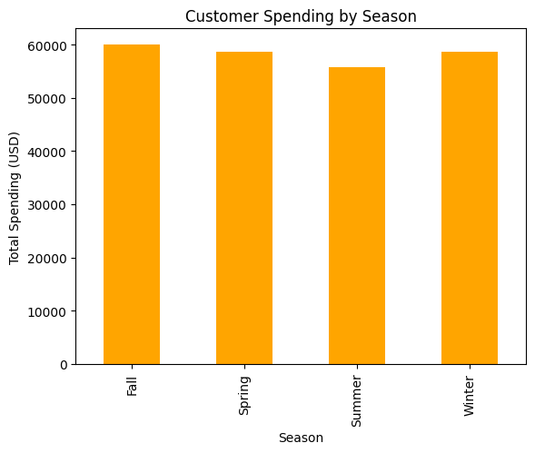
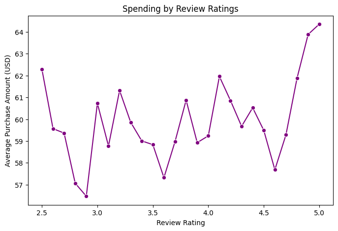
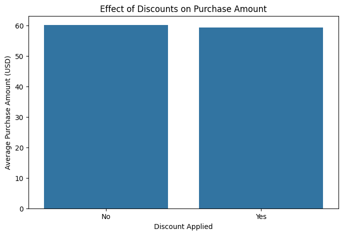

# Shopping Trends Analysis 📊

A comprehensive **Exploratory Data Analysis (EDA)** project focused on identifying customer shopping patterns, preferences, and behaviors. This project utilizes a structured dataset of 3900 rows and 18 columns to extract actionable insights for enhancing customer engagement and optimizing sales strategies.

---

## 📑 Overview

The project includes the following key components:

- **Data Cleaning**: Ensured dataset integrity and addressed inconsistencies.  
- **Descriptive Analysis**: Summarized key statistics for better understanding.  
- **Data Visualization**: Utilized charts and graphs to uncover trends.  
- **Insights & Recommendations**: Provided actionable findings for strategic improvements.

---

## 🗂 Dataset Description

The dataset contains the following columns:

| Column Name            | Description                                                                 |
|-------------------------|-----------------------------------------------------------------------------|
| **Customer ID**         | Unique identifier for each customer.                                       |
| **Age**                 | Customer age for demographic analysis.                                     |
| **Gender**              | Gender information for segmentation.                                       |
| **Item Purchased**      | Products bought by customers.                                              |
| **Category**            | Grouped product categories like clothing, footwear, etc.                  |
| **Purchase Amount (USD)**| Amount spent by customers on purchases.                                   |
| **Location**            | Geographical location of customers.                                       |
| **Size**                | Product size preferences.                                                 |
| **Color**               | Color preferences of purchased items.                                     |
| **Season**              | Seasonal shopping patterns.                                               |
| **Review Rating**       | Customer feedback on products.                                            |
| **Subscription Status** | Indicates customer subscription status.                                   |
| **Shipping Type**       | Preferred delivery methods.                                               |
| **Discount Applied**    | Whether a discount was applied to purchases.                              |
| **Promo Code Used**     | Promo codes utilized during transactions.                                 |
| **Previous Purchases**  | Number of previous purchases by customers.                                |
| **Payment Method**      | Preferred payment options.                                                |
| **Frequency of Purchases** | Frequency of customer transactions.                                    |

---

## 🚀 Features

- **Uncover Seasonal Trends**: Analyzing how purchase behaviors vary across seasons.
- **Understand Demographics**: Identifying key customer groups based on age, gender, and location.
- **Analyze Spending Habits**: Insights into how much customers spend and what they purchase.
- **Evaluate Discounts & Promotions**: Assessing the impact of discounts and promo codes.

---

## 🛠️ Setup Instructions

### Prerequisites

Ensure you have Python 3.x installed along with the following libraries:

- pandas  
- numpy  
- matplotlib  
- seaborn  
- jupyter  /  vscode

### Installation Steps

1. Clone this repository:  
   ```bash
   git clone https://github.com/yourusername/shopping-trends-analysis.git
   ```

2. Navigate to the project directory:  
   ```bash
   cd shopping-trends-analysis
   ```

3. Install the required libraries:  
   ```bash
   pip install -r requirements.txt
   ```

4. Launch Jupyter Notebook:  
   ```bash
   jupyter notebook
   ```

---

## 📊 Visualizations

### Example Visuals:

1. **Sales Trends by Season**  
   

2. **Demographics and Spending Patterns**  
   

3. **Impact of Discounts**  
   

---

## 💡 Key Insights

1. **Seasonal Trends**: Higher purchases during festive seasons indicate a clear opportunity for targeted promotions.  
2. **Gender-based Patterns**: Women tend to spend more on clothing, while men prefer electronics.  
3. **Location Impact**: Urban areas show a higher frequency of purchases.  
4. **Promo Effectiveness**: Discounts and promo codes significantly influence customer buying decisions.  


